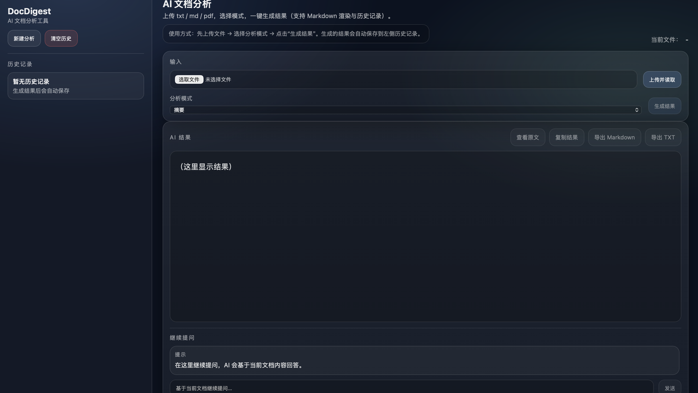
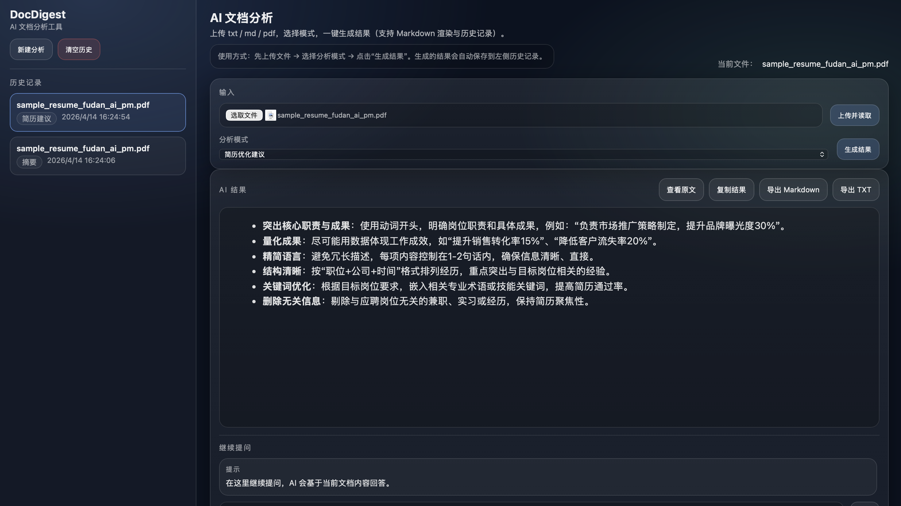
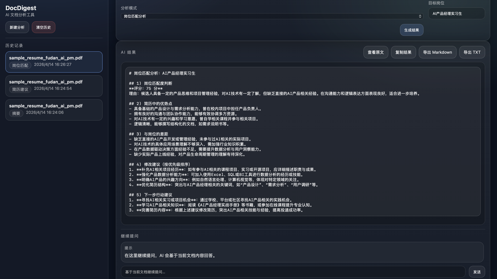

# DocDigest — AI Document Analyzer & Job Fit Assistant

**One-liner:** Turn resumes and documents (`txt / md / pdf`) into actionable insights — summaries, bullet points, outlines, resume improvement tips, and **job fit analysis** — with chat follow-ups and export-ready results.

## Why this project

Most “document summarizers” stop at a single output. DocDigest is built to feel like a small, real product:

- **Document → Insight**: not only summarize, but structure, extract, and advise.
- **Job fit** (岗位匹配分析): analyze a resume against a target role and suggest concrete next steps.
- **Local-first**: runs on your machine, keeps history in the browser (no database).

## Core Features

- **File upload & text extraction**: `txt / md / pdf`
- **Analysis modes**
  - **Summary** (concise)
  - **Key points** (bullet points)
  - **Outline** (structured)
  - **Resume improvement suggestions**
  - **Job fit analysis** (岗位匹配分析) with a target role input
- **Chat follow-ups**: keep asking questions based on the current document (session-only)
- **Result usability**
  - Markdown rendering
  - Copy to clipboard
  - Export raw Markdown / plain text
- **History**: automatically saved in `localStorage` (open, switch, clear)

## Screenshots

> Place these files under `docdigest/screenshots/` to enable the preview on GitHub.





## Tech Stack

- **Node.js + Express** for the server
- **Vanilla HTML/CSS/JS** for the UI (no framework)
- **DashScope / Qwen** (compatible-mode Chat Completions) for AI analysis
- **pdf-parse** for PDF text extraction

## Project Structure

```text
docdigest/
  server.js                # Express server: upload, summarize, chat
  public/
    index.html             # UI layout
    style.css              # UI styling
    main.js                # Client logic: analysis, history, chat, export
  .env.example             # Environment variables template
  .gitignore
  LICENSE
  README.md
  screenshots/             # (optional) add screenshots for GitHub preview
```

## Getting Started

```bash
cd docdigest
npm install
cp .env.example .env
npm start
```

Open `http://localhost:3000`.

## Environment Variables

Create a `.env` file (or export env vars in your shell):

```env
DASHSCOPE_API_KEY=your_api_key_here
PORT=3000
```

- `DASHSCOPE_API_KEY` (required): DashScope API key
- `PORT` (optional): server port (default `3000`)

## Usage Flow

1. Upload a document (`txt / md / pdf`).
2. Choose an analysis mode.
3. (Optional) If you select **Job fit analysis**, fill in the **Target role**.
4. Click **Generate** to get the result.
5. Use **Copy / Export** to reuse the output.
6. Ask follow-up questions in **Chat** based on the current document.

## Example Use Cases

- **Resume review**: identify strengths, rewrite wording, and improve structure.
- **Job fit analysis**: evaluate match, gaps, and next actions for a target role.
- **Document digest**: turn long notes into an outline + bullet points.

## Roadmap

- Deployment: Docker / one-click run
- Better “chat with document”: multi-turn memory per document
- More file types (e.g., docx) and better text extraction
- Multi-model support (configurable model/provider)
- Streaming responses for long outputs

## License

MIT — see [`LICENSE`](LICENSE).

