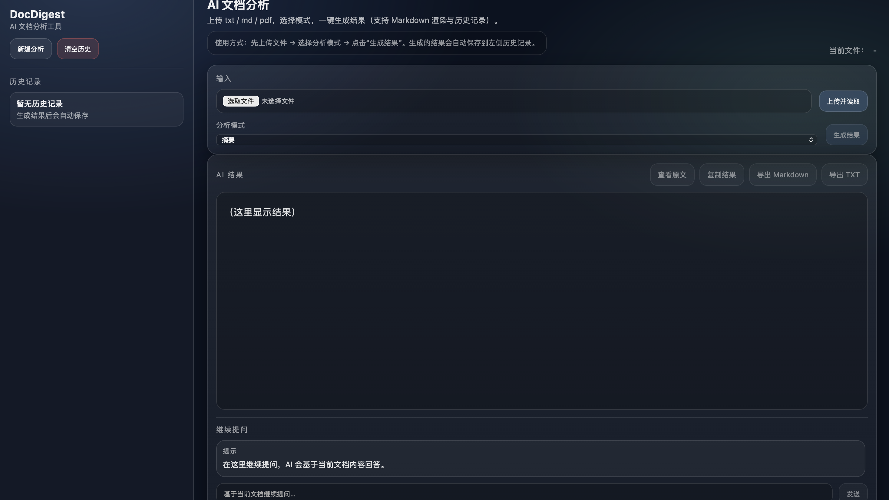
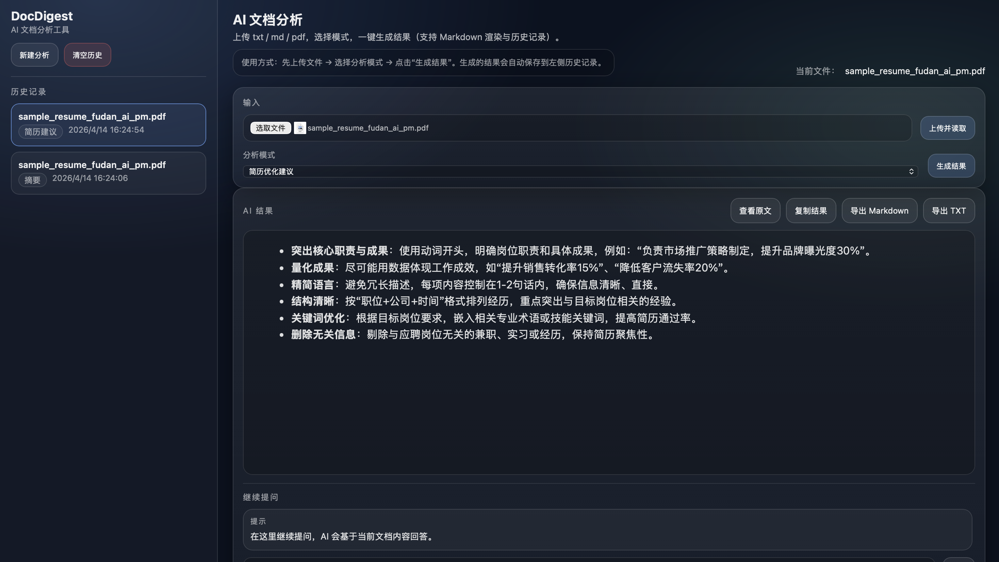
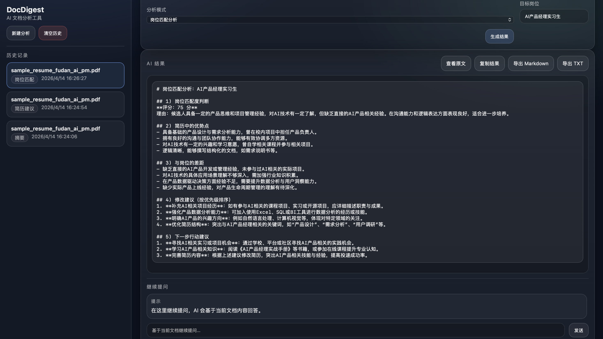

<!-- 顶部 banner -->
<div align="center">

# 📄 DocDigest

<p>
  
</p>

**Local-first AI document analyzer for resume workflows and high-signal reading**

<p>
  <a href="https://nodejs.org"></a>
  <a href="https://expressjs.com"></a>
  <a href="https://help.aliyun.com/zh/model-studio/"></a>
  <a href="./LICENSE"></a>
  
</p>

[**🌐 Live Demo**](https://docdigest-ai-production.up.railway.app) · [**🚀 Quick Start**](#-quick-start) · [**🎯 Use Cases**](#-use-cases) · [**🗺 Roadmap**](#-roadmap)

</div>

---

## 📸 Preview

| Home | Resume Analysis | Job Fit |
|---|---|---|
|  |  |  |

---

## ✨ What is this

DocDigest is a **local-first AI document analyzer** built for resume workflows and dense reading.

Instead of producing one generic summary, it helps you:

- 🧐 **Understand** — extract structured insights from `.txt / .md / .pdf`
- ✏️ **Improve** — get actionable rewrites and structure tips for your resume
- 🎯 **Match** — input a target role, get fit score + strengths/gaps + next steps

> Built to feel like a **small product you can demo**, not a one-off script.

---

## 🚀 Key Capabilities

<table>
<tr>
<td width="50%" valign="top">

### 📄 Document Understanding
- Upload `.txt` / `.md` / `.pdf`
- Extract text locally (PDF via `pdf-parse`)
- AI generates **Summary**, **Key Points**, **Outline**
- Markdown rendering for readability

### 💼 Resume & Job Fit
- Actionable resume improvement suggestions
- **岗位匹配分析** with a target role input
- Match score + strengths + gaps + next steps

</td>
<td width="50%" valign="top">

### 💬 Interactive Follow-ups
- Chat on top of **current document + current analysis**
- Session-only history (no server persistence)
- Stays grounded in document context

### 📤 Shareable Output
- One-click copy to clipboard
- Export raw **Markdown** or **plain text**
- Local analysis history in `localStorage`

</td>
</tr>
</table>

### 🔑 BYOK Mode

- **Free**: upload + extract/preview/copy text — no API key needed
- **BYOK**: add your DashScope key in browser to unlock all AI features
- Key stored in `localStorage` only — server **never** persists it

---

## 🧠 How It Works

```
┌──────────┐    ┌──────────┐    ┌──────────┐    ┌──────────┐
│  Upload  │ ─→ │  Parse   │ ─→ │  Analyze │ ─→ │  Render  │
│ (txt/pdf)│    │ (server) │    │ (Qwen AI)│    │+ Export  │
└──────────┘    └──────────┘    └──────────┘    └──────────┘
                                       │
                                       ↓
                                ┌──────────────┐
                                │ Chat follow- │
                                │ ups grounded │
                                │ in context   │
                                └──────────────┘
```

---

## 🚀 Quick Start

```bash
git clone https://github.com/theAtlantic-zza/Docdigest-ai.git
cd Docdigest-ai/docdigest
npm install
cp .env.example .env
npm start
```

Open `http://localhost:3000`.

<details>
<summary><b>🔑 Configure DashScope API key (optional, unlocks AI features)</b></summary>

**Option 1: In-browser** — paste your key into the API Key panel.
Stored in `localStorage` as `dashscope_api_key`. Server never stores it.

**Option 2: `.env` for local dev**

```env
DASHSCOPE_API_KEY=your_api_key_here
PORT=3000
```

| Variable | Required | Notes |
|---|---|---|
| `DASHSCOPE_API_KEY` | Optional | Only needed if you don't use BYOK |
| `PORT` | Optional | Defaults to `3000` |

</details>

---

## 🎯 Use Cases

- 📋 **Resume optimization** — rewrite bullets, improve clarity, surface strengths
- 🎯 **Job matching** — evaluate fit against a target role and plan next actions
- 📚 **Document summarization** — turn long notes into outline + key points

---

## 🛠 Tech Stack

| Layer | Tech |
|---|---|
| Backend | **Node.js + Express** |
| Frontend | Vanilla **HTML / CSS / JS** (no framework) |
| AI | **DashScope / Qwen** (OpenAI-compatible Chat API) |
| PDF | `pdf-parse` |
| Deployment | Railway |

> Language mix: JavaScript 68% · CSS 19% · HTML 13%

---

## 📦 Project Structure

```
docdigest/
├── server.js              # upload, summarize, chat endpoints
├── public/
│   ├── index.html         # UI
│   ├── style.css          # styling
│   └── main.js            # client logic (history / chat / export)
├── .env.example
└── README.md
```

---

## 📌 Design Philosophy

**Free parsing first, AI optional** — make document understanding accessible without cost.
**Local-first** — no document storage server-side; users own their data.

---

## 🌐 Deployment (Railway)

- Set **Root Directory** to `docdigest/`
- `PORT` is handled by Railway automatically
- `DASHSCOPE_API_KEY` is **not required** in production (BYOK by default)

---

## 🗺 Roadmap

- [ ] Docker / one-click run
- [ ] Better multi-turn chat memory per document
- [ ] `.docx` support and improved extraction quality
- [ ] Multi-model support (configurable provider / model)
- [ ] Streaming responses for long outputs

---

## 📄 License

[MIT](./LICENSE) © 2026 theAtlantic-zza

<div align="center">

---

**DocDigest** — From raw documents to hiring-ready insights.

If this project is useful, consider giving it a ⭐

</div>
